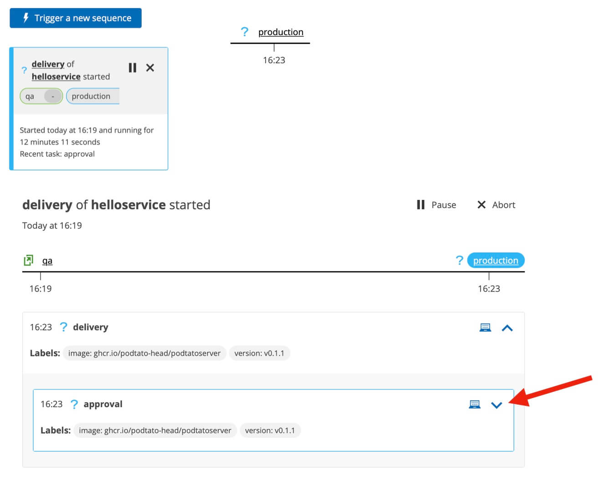
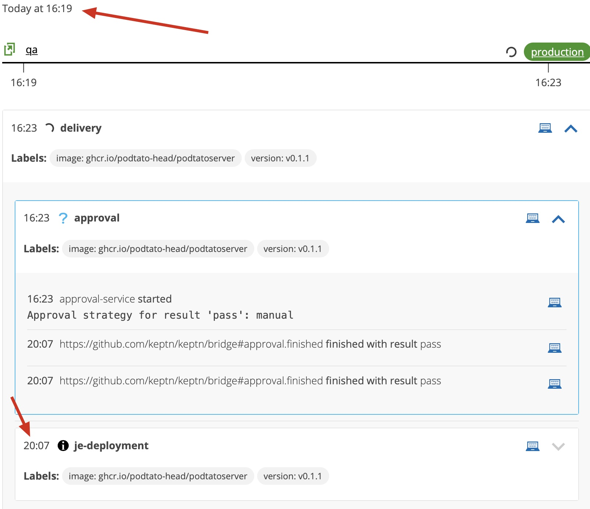



# Add Manual Production Approval Step

This is step 2 of the tutorial. If you missed step 1, [start here first](full-tour.md).

## Manual Approval

Add a step to the delivery sequence which enforces that a user must manually click ✅ before an artifact is promoted to production.

In your Git upstream repo, modify `shipyard.yaml` on the `main` branch. Add a new task in `production` before the `je-deployment` task:

```
- name: "approval"
  properties:
    pass: "manual"
    warning: "manual"
```

Your shipyard should now look like this:
```
apiVersion: "spec.keptn.sh/0.2.2"
kind: "Shipyard"
metadata:
  name: "shipyard-delivery"
spec:
  stages:
    - name: "qa"
      sequences:
        - name: "delivery"
          tasks:
            - name: "je-deployment"
            - name: "je-test"

    - name: "production"
      sequences:
        - name: "delivery"
          triggeredOn:
            - event: "qa.delivery.finished"
          tasks:
            - name: "approval"
              properties:
                pass: "manual"
                warning: "manual"
            - name: "je-deployment"
```

## Deliver Artifact

In the [web terminal](http://localhost:{{ site.ttyd_port }}) run the same command as before to trigger delivery of an artifact.

```
keptn trigger delivery \
--project=fulltour \
--service=helloservice \
--image="ghcr.io/podtato-head/podtatoserver:v0.1.1" \
--labels=image="ghcr.io/podtato-head/podtatoserver",version="v0.1.1"
```

## Approve Production Release

The artifact will be released into `qa` as before but the sequence now turns blue.

Manual interaction is required.

The sequence will pause here for as long as required.




Click the `production` link then inside the approval step, click ✅ to approve the build. Watch as the deployment begins, again via `helm`, facilitated by the job executor service.



