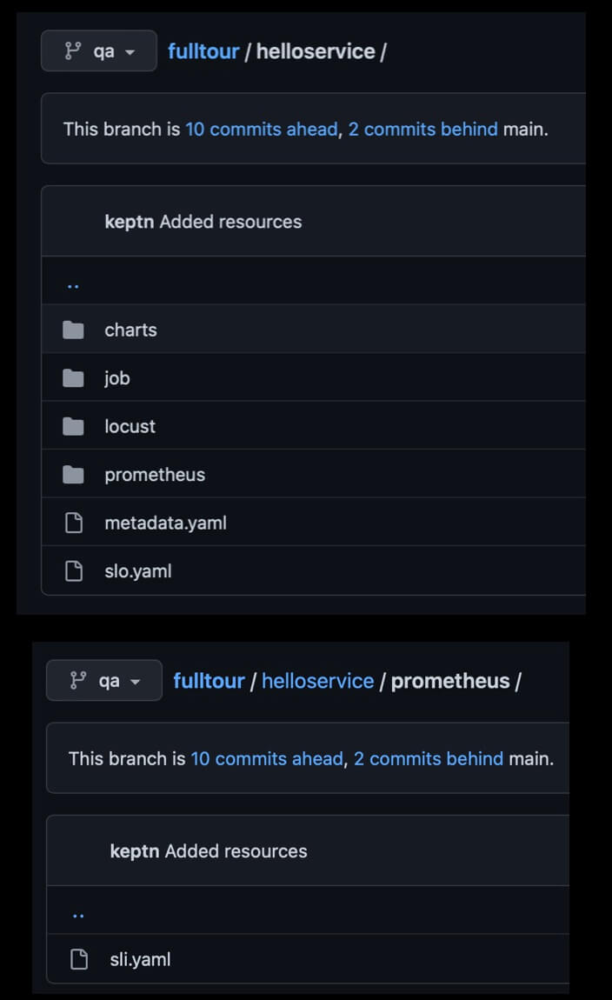
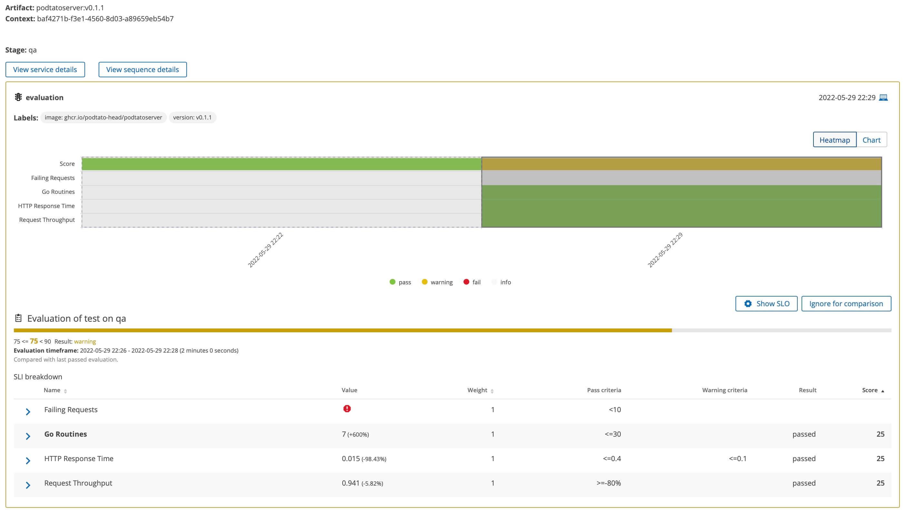
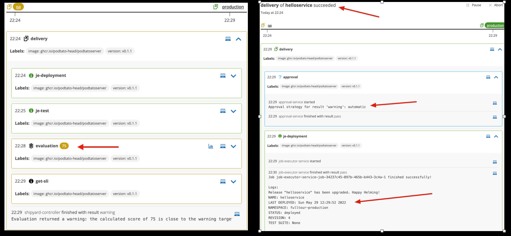



# Go / No Go Quality Evaluation

This is step 3 of the tutorial. If you missed the previous parts, [start here](full-tour.md)

----

## Automating a Go or No Go Production Decision

In this step an automated go / no-go decision step will be added. If, based on your criteria, keptn decides the artifact is a `pass`, the release will be automatically promoted to production.

If the evaluation is a `failure`, the release will be blocked.

----

## Add Prometheus
To monitor the deployments, we need to add a monitoring provider. This tutorial will use Prometheus. Keptn currently supports the following providers:



Using the [web terminal](http://localhost:{{ .site.ttyd_port }}), install Prometheus on the cluster:

```
kubectl create namespace monitoring
helm repo add prometheus-community https://prometheus-community.github.io/helm-charts
helm install prometheus prometheus-community/prometheus --namespace monitoring --wait
```

----

## Keptn Retrieves SLIs from Prometheus

Keptn needs to know how to interact with Prometheus; a keptn SLI provider service is used.

This service "knows" how to retrieve metrics from Prometheus so we need this **in addition to** Prometheus itself.

```
helm install -n keptn prometheus-service https://github.com/keptn-contrib/prometheus-service/releases/download/{{ .site.prometheus_service_version }}/prometheus-service-{{ .site.prometheus_service_version }}.tgz --wait
kubectl apply -f https://raw.githubusercontent.com/keptn-contrib/prometheus-service/{{ .site.prometheus_service_version }}/deploy/role.yaml -n monitoring
```

----

## Add Prometheus SLIs and SLOs
The keptn prometheus service needs to know the metrics (or SLIs) to retrieve from Prometheus.

When the metrics are retrieved, they're passed to the keptn core lighthouse service microservice who uses the metrics in conjunction with the SLO definition file.

Every metric receives an individual pass / warning or fail score. The overall evaluation also receives a pass, warning or fail result.

Add these two important files now via the [web terminal](http://localhost:{{ .site.ttyd_port }}) or create and upload the files directly to the `qa` branch of the Git upstream at `helloservice/prometheus/sli.yaml` and `helloservice/slo.yaml`.

```
cd ~/keptn-job-executor-delivery-poc
keptn add-resource --project=fulltour --service=helloservice --stage=qa --resource=prometheus/sli.yaml --resourceUri=prometheus/sli.yaml
keptn add-resource --project=fulltour --service=helloservice --stage=qa --resource=slo.yaml --resourceUri=slo.yaml
```



----

## Tell Keptn to Use Prometheus Service for Project

Prometheus is installed, the prometheus SLI provider service is installed and the metrics and SLO file are present in the Git repo.

However, we still haven't told Keptn to use Prometheus for the `helloservice` of the `fulltour` project.

Do so now:

```
keptn configure monitoring prometheus --project=fulltour --service=helloservice
```

## Add the Evaluation Gate

Monitoring and metric collection is now complete. All that remains is to add the quality gate. This is much like adding the approval task.

Modify the shipyard file on the `main` branch and add the `evaluation` task as the final step in the `qa` stage. Tell keptn to retrieve the previous 2 minutes of data:

```
- name: "evaluation"
  properties:
    timeframe: "2m"
```

Change the properties of the production `approval` task to automatically approve the release if the evaluation is a `pass` or `warning`. If the evaluation is a failure, the release will be blocked and the delivery sequence will fail (as it should because the artifact is bad).

The shipyard should now look like this:

```
apiVersion: "spec.keptn.sh/0.2.2"
kind: "Shipyard"
metadata:
  name: "shipyard-delivery"
spec:
  stages:
    - name: "qa"
      sequences:
        - name: "delivery"
          tasks:
            - name: "je-deployment"
            - name: "je-test"
            - name: "evaluation"
              properties:
                timeframe: "2m"

    - name: "production"
      sequences:
        - name: "delivery"
          triggeredOn:
            - event: "qa.delivery.finished"
          tasks:
            - name: "approval"
              properties:
                pass: "automatic"
                warning: "automatic"
            - name: "je-deployment"
```

----

## 🎉 Trigger Delivery

Once again, trigger delivery of the artifact:



----

## Outcome

The artifact receives a warning score which we told keptn was still good enough to allow an automatic release. Keptn stores a full history of every previous evaluation and will automatically compare new builds against old.




Check the application version running in each environment:



Should show `{{ .site.good_version }}` in both environments.

----

## Attempt to Release a Slow Build

Now attempt to release a slow build. Keptn will release the artifact to `qa` as there are no quality checks in `qa`.
The quality evaluation before production will fail (as it should), thus the slow artifact is never released to production - protecting users.




Check the application version running in each environment:



Should show `{{ .site.slow_version }}` in `qa` and `{{ .site.good_version }}` in `production`.

----

## What's Next?

Hopefully releases are now regression-proof and bad builds never make it to production.

In reality though, problems may only occur in production so the release process can be enhanced further.

In the next part of this tutorial, a post-release quality evaluation will be added to the production environment which runs after each successful release.

If this evaluation fails, it is a signal that perhaps we should rollback the release.

[Add a production evaluation now >>](full-tour-4-prod-evaluations.md)
