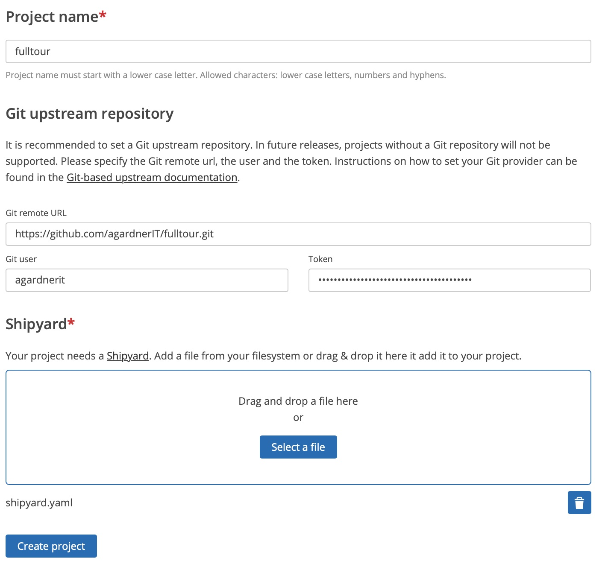

# End-to-End Delivery

If you have just installed the kind keptn, [go here](first-steps.md) first to understand the out-of-the-box demo.

The following tutorial was heavily influenced this [excellent JES PoC tutorial](https://github.com/christian-kreuzberger-dtx/keptn-job-executor-delivery-poc) by @christian-kreuzberger-dtx. Thanks Christian for doing the hard work!

## Goal

The goal of this tutorial is to:
- Deploy a service (using `helm upgrade`)
- Generate load (using [locust](https://locust.io)) against this service

The tutorial will progress in steps:
1. Automated testing and releases into `qa` and `production` stages
2. An approval step will be added to ensure a human must always click "go" before a production release.
3. Add Prometheus to the cluster to monitor the workloads. Add SLO-based quality evaluations to ensure no bad build every makes it to production.
4. Add quality evaluations in production, post rollout. If a bad deployment occurs, the evaluation will fail and remediation actions (rollback?) can be actioned.

## Create New Project

1. Please create a brand new, uninitialised Git repository
2. Save the following shipyard file which defines the new environment
3. Use the keptn's bridge to create the project visually OR create this file and use the [web terminal](http://localhost:{{ site.ttyd_port }})

Web terminal command:
```
keptn create project fulltour \
--shipyard shipyard.yaml \
--git-remote-url <YOUR-GIT-REPO> \
--git-user <YOUR-GIT-USERNAME> \
--git-token <YOUR-GIT-PAT-TOKEN>
```

**shipyard.yaml**
```
apiVersion: "spec.keptn.sh/0.2.2"
kind: "Shipyard"
metadata:
  name: "shipyard-delivery"
spec:
  stages:
    - name: "qa"
      sequences:
        - name: "delivery"
          tasks:
            - name: "je-deployment"
            - name: "je-test"

    - name: "production"
      sequences:
        - name: "delivery"
          triggeredOn:
            - event: "qa.delivery.finished"
          tasks:
            - name: "je-deployment"
```




