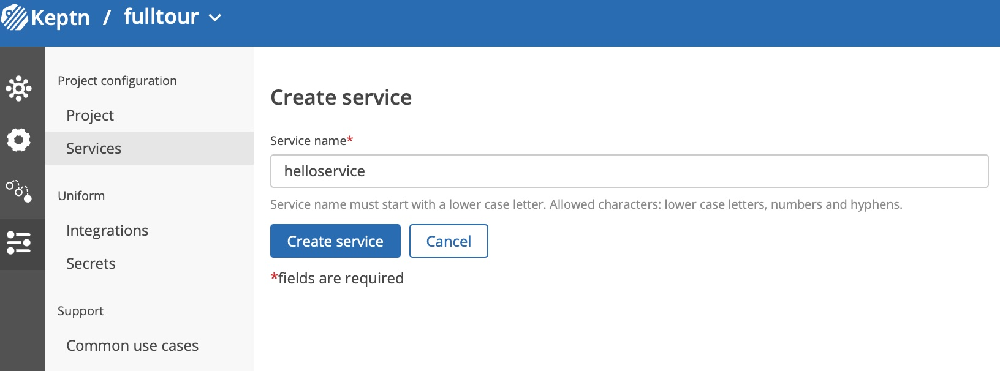

# End-to-End Delivery

If you have just installed the kind keptn, [go here](first-steps.md) first to understand the out-of-the-box demo.

The following tutorial was heavily influenced this [excellent JES PoC tutorial](https://github.com/christian-kreuzberger-dtx/keptn-job-executor-delivery-poc) by @christian-kreuzberger-dtx. Thanks Christian for doing the hard work!

----

## Goal

The goal of this tutorial is to:
- Deploy a service (using `helm upgrade`)
- Generate load (using [locust](https://locust.io)) against this service

The tutorial will progress in steps:
1. Automated testing and releases into `qa` and `production` stages
2. An approval step will be added to ensure a human must always click "go" before a production release.
3. Add Prometheus to the cluster to monitor the workloads. Add SLO-based quality evaluations to ensure no bad build every makes it to production.
4. Add a quality evaluation in production, post rollout. If a bad deployment occurs, the evaluation will fail and remediation actions (rollback?) can be actioned.

----

## Create New Project

1. Please create a brand new, uninitialised Git repository
2. Save the following shipyard file which defines the new environment
3. Use the keptn's bridge to create the project visually OR create this file and use the [web terminal](http://localhost:{{ site.ttyd_port }})

Web terminal command:
```
keptn create project fulltour \
--shipyard shipyard.yaml \
--git-remote-url <YOUR-GIT-REPO> \
--git-user <YOUR-GIT-USERNAME> \
--git-token <YOUR-GIT-PAT-TOKEN>
```

**shipyard.yaml**
```
apiVersion: "spec.keptn.sh/0.2.2"
kind: "Shipyard"
metadata:
  name: "shipyard-delivery"
spec:
  stages:
    - name: "qa"
      sequences:
        - name: "delivery"
          tasks:
            - name: "je-deployment"
            - name: "je-test"

    - name: "production"
      sequences:
        - name: "delivery"
          triggeredOn:
            - event: "qa.delivery.finished"
          tasks:
            - name: "je-deployment"
```


----

## Create Service
Create a service called `hellodemo` (it must be called precisely that - you will see why later). Do it either via the UI or the `keptn` CLI command in the [web terminal](http://localhost:{{ site.ttyd_port }}):

```
keptn create service helloservice --project=fulltour
```



----

## Add Required Files

Provide keptn with the important files it needs during the sequence execution. Your choice: Either upload directly to the upstream Git repo or use the `keptn add resource` commands. The result is the same. `keptn add resource` is just a helpful wrapper around `git add / commit / push`

In the [web terminal](http://localhost:{{ site.ttyd_port }}), clone Christian's PoC repo to download all necessary files:

```
git clone https://github.com/christian-kreuzberger-dtx/keptn-job-executor-delivery-poc.git
```

Add the helm chart (this is the real application we will deploy). The `--resource` path is the path to files on disk whereas `--resourceUri` is the Git target folder. Do not change these. Notice also we're uploading a helm chart with a name matching the keptn service: `helloservice.tgz`

```
cd keptn-job-executor-delivery-poc
keptn add-resource --project=fulltour --service=helloservice --all-stages --resource=./helm/helloservice.tgz --resourceUri=charts/helloservice.tgz
```

Add the files that locust needs:
```
keptn add-resource --project=fulltour --service=helloservice --stage=qa --resource=./locust/basic.py
keptn add-resource --project=fulltour --service=helloservice --stage=qa --resource=./locust/locust.conf
```

Add the job executor service config file. This tells the JES what container and commands to execute for each keptn task:

```
keptn add-resource --project=fulltour --service=helloservice --all-stages --resource=job-executor-config.yaml --resourceUri=job/config.yaml
```

## Job Executor Must Listen for Events
The job executor service is currently configured to only listen and react on the `sh.keptn.event.hello-world.triggered` event. This was set during the initial installation.

We need the JES to fire on our new task events: `sh.keptn.event.je-deployment.triggered` and `sh.keptn.event.je-test.triggered`

Add these new events by updating the JES helm chart. Alternatively, event subscriptions can be adjusted in the UI ([keptn's bridge](http://localhost/bridge)). 

```
JES_VERSION={{ site.job_executor_service_version }}
helm upgrade --namespace keptn-jes \
--wait --timeout=10m \
--set=remoteControlPlane.topicSubscription="sh.keptn.event.hello-world.triggered\,sh.keptn.event.je-deployment.triggered\,sh.keptn.event.je-test.triggered" \
job-executor-service https://github.com/keptn-contrib/job-executor-service/releases/download/$JES_VERSION/job-executor-service-$JES_VERSION.tgz
```


