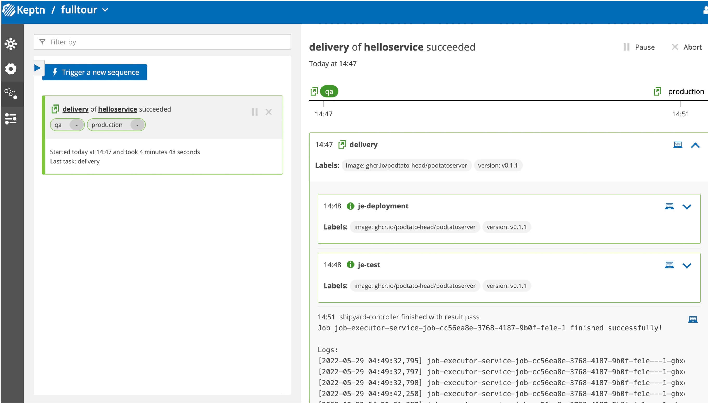



# End-to-End Delivery

If you have just installed the kind keptn, [go here](first-steps.md) first to understand the out-of-the-box demo.

The following tutorial was heavily influenced and expands upon this [excellent JES PoC tutorial](https://github.com/christian-kreuzberger-dtx/keptn-job-executor-delivery-poc) by @christian-kreuzberger-dtx. Thanks Christian for doing the hard work!

----

## Goal

The goal of this tutorial is to:
- Deploy a service (using [helm](https://helm.sh))
- Generate load on the deployed service (using [locust](https://locust.io))

The tutorial will progress in steps:
1. Automated testing and releases into `qa` and `production` stages
2. An approval step will be added to ensure a human must always click "go" before a production release.
3. Add Prometheus to the cluster to monitor the workloads. Add SLO-based quality evaluations to ensure no bad build ever makes it to production.
4. Add a quality evaluation in production, post rollout. If a bad deployment occurs, the evaluation will fail and remediation actions (rollback?) can be actioned.

----

## Create New Project

1. Please create a brand new, uninitialised Git repository
2. Save the following shipyard file which defines the new environment
3. Use the keptn's bridge to create the project visually OR create this file and use the [web terminal](http://localhost:{{ site.ttyd_port }})

Web terminal command:
```
cd ~
cat << EOF > shipyard.yaml
apiVersion: "spec.keptn.sh/0.2.2"
kind: "Shipyard"
metadata:
  name: "shipyard-delivery"
spec:
  stages:
    - name: "qa"
      sequences:
        - name: "delivery"
          tasks:
            - name: "je-deployment"
            - name: "je-test"

    - name: "production"
      sequences:
        - name: "delivery"
          triggeredOn:
            - event: "qa.delivery.finished"
          tasks:
            - name: "je-deployment"
EOF
keptn create project fulltour \
--shipyard shipyard.yaml \
--git-remote-url <YOUR-GIT-REPO> \
--git-user <YOUR-GIT-USERNAME> \
--git-token <YOUR-GIT-PAT-TOKEN>
```


----

## Create Service
Create a service called `helloservice`. It must be called precisely that because the helm chart we use is called `helloservice.tgz` and the job executor runs `helm install` and relies on a file being available called `helloservice.tgz`.

Do it either via the UI or the `keptn` CLI command in the [web terminal](http://localhost:{{ site.ttyd_port }}):

```
keptn create service helloservice --project=fulltour
```


----

## Add Required Files

Provide keptn with the important files it needs during the sequence execution. Your choice: Either upload directly to the upstream Git repo or use the `keptn add resource` commands. The result is the same. `keptn add resource` is just a helpful wrapper around `git add / commit / push`

In the [web terminal](http://localhost:{{ site.ttyd_port }}), clone Christian's PoC repo to download all necessary files:

```
git clone https://github.com/christian-kreuzberger-dtx/keptn-job-executor-delivery-poc.git
```

Add the helm chart (this is the real application we will deploy). The `--resource` path is the path to files on disk whereas `--resourceUri` is the Git target folder. Do not change these. Notice also we're uploading a helm chart with a name matching the keptn service: `helloservice.tgz`

```
cd keptn-job-executor-delivery-poc
keptn add-resource --project=fulltour --service=helloservice --all-stages --resource=./helm/helloservice.tgz --resourceUri=charts/helloservice.tgz
```

Add the files that locust needs:
```
keptn add-resource --project=fulltour --service=helloservice --stage=qa --resource=./locust/basic.py
keptn add-resource --project=fulltour --service=helloservice --stage=qa --resource=./locust/locust.conf
```

Add the job executor service config file. This tells the JES what container and commands to execute for each keptn task:

```
keptn add-resource --project=fulltour --service=helloservice --all-stages --resource=job-executor-config.yaml --resourceUri=job/config.yaml
```

----

## Provide additional permissions for Job Executor Service

This gives the `helm deploy` task full cluster-admin access to your Kubernetes cluster. This is not recommended for production setups, but it is needed for this PoC to work (e.g., helm upgrade needs to be able to create namespaces, secrets, ...)

```
kubectl apply -f https://raw.githubusercontent.com/christian-kreuzberger-dtx/keptn-job-executor-delivery-poc/main/job-executor/workloadClusterRoles.yaml
```

----

## Job Executor Must Listen for Events
The job executor service is currently configured to only listen and react on the `sh.keptn.event.hello-world.triggered` event. This was set during the initial installation.

We need the JES to fire on our new task events: `sh.keptn.event.je-deployment.triggered` and `sh.keptn.event.je-test.triggered`

Go to the [integration page](http://localhost/bridge/project/fulltour/settings/uniform/integrations) and add two new integrations for `je-deployment.triggered` and `je-test.triggered`.


The job executor service subscriptions should look like this:


<!-- 
Wait for outcome of: https://github.com/keptn/keptn/issues/7885

Add these new events by updating the JES helm chart. Alternatively, event subscriptions can be adjusted in the UI ([keptn's bridge](http://localhost/bridge)). 

```
JES_VERSION={{ site.job_executor_service_version }}
KEPTN_API_PROTOCOL=http
KEPTN_API_HOST=api-gateway-nginx.keptn
KEPTN_API_TOKEN=$(kubectl get secret keptn-api-token -n keptn -ojsonpath={.data.keptn-api-token} | base64 -d)
TASK_SUBSCRIPTION='sh.keptn.event.hello-world.triggered\,sh.keptn.event.je-deployment.triggered\,sh.keptn.event.je-test.triggered'

helm upgrade -n keptn-jes \
job-executor-service \
https://github.com/keptn-contrib/job-executor-service/releases/download/$JES_VERSION/job-executor-service-$JES_VERSION.tgz \
--set remoteControlPlane.topicSubscription="${TASK_SUBSCRIPTION}",remoteControlPlane.api.protocol=${KEPTN_API_PROTOCOL},remoteControlPlane.api.hostname=${KEPTN_API_HOST},remoteControlPlane.api.token=${KEPTN_API_TOKEN}
```
-->

----

## 🎉 Trigger Delivery
You are now ready to trigger delivery of the `helloservice` helm chart into all stages, testing along the way with locust:

You can trigger a sequence via the [keptn's API](http://localhost/api/swagger-api), via the bridge UI or via the keptn CLI:

```
keptn trigger delivery \
--project=fulltour \
--service=helloservice \
--image="ghcr.io/podtato-head/podtatoserver:v0.1.1" \
--labels=image="ghcr.io/podtato-head/podtatoserver",version="v0.1.1"
```



----

## What Happened?

Run `kubectl get namespaces` in the [web terminal](http://localhost:{{ site.ttyd_port }})

Notice the 2 new namespaces: `fulltour-qa` and `fulltour-production`. Your app `helloservice.tgz` is deployed into each namespace thanks to the job executor service that ran `helm` (look at the `qa` and `production` branches in your repo at `helloservice/job/config.yaml`).

Helm is told to deploy `$(KEPTN_STAGE).tgz` (ie. `helloservice.tgz`).

```
bash-5.1# kubectl get ns
NAME                  STATUS
default               Active
kube-system           Active
kube-public           Active
kube-node-lease       Active 
keptn                 Active  
keptn-jes             Active   
fulltour-qa           Active   2m
fulltour-production   Active   2m
```

Also notice that during the `je-test` task, locust was executed. The `job/config.yaml` file also shows how this was done.

Result: Keptn orchestrated your deployment which was acheived using `helm` and `locust` to generate load.

----

## What's Next?

Your application is being deployed into both QA and Production. This is great and indeed Keptn works with ArgoCD and Flux in the same way to ensure code is always up to date.

Sometimes, a manual approval step is required before an artifact is promoted to production. This is especially important right now as we are not testing the quality of the `helloservice` artifact. [Add an approval step now](full-tour-2-approval-step.md).

